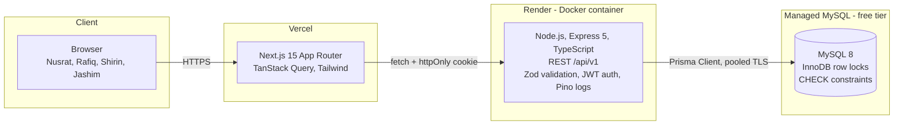
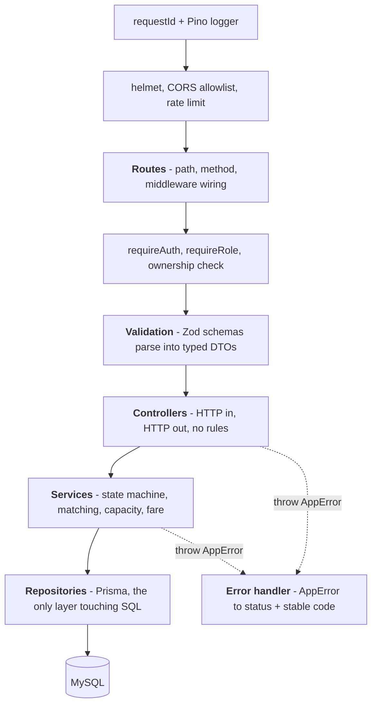
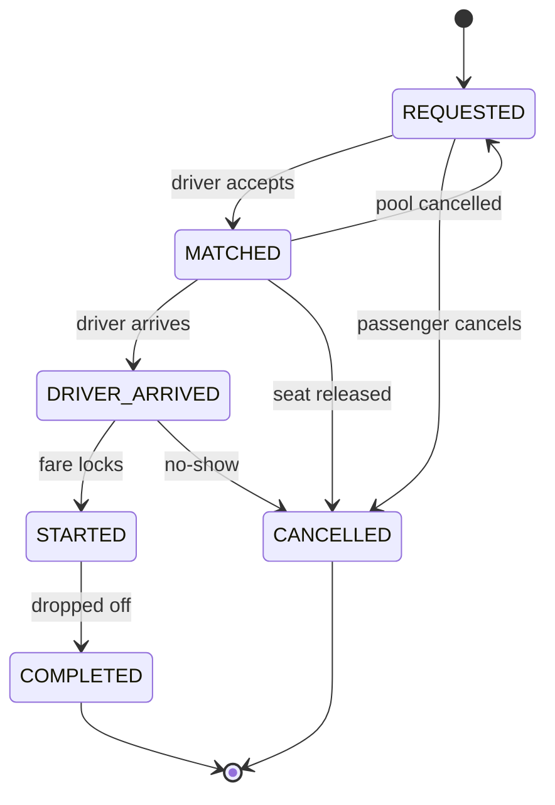
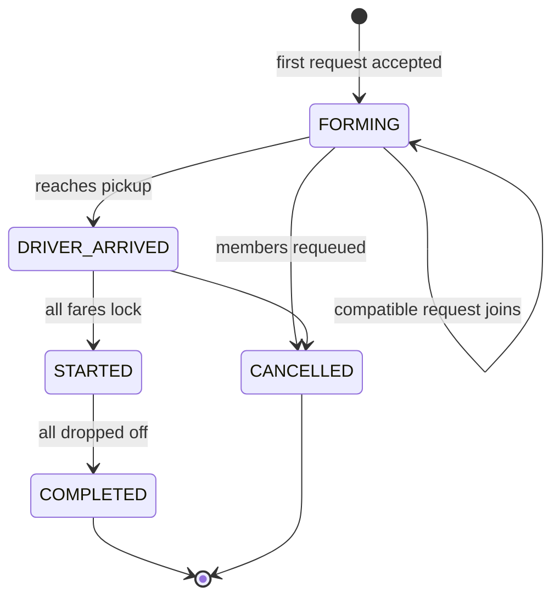
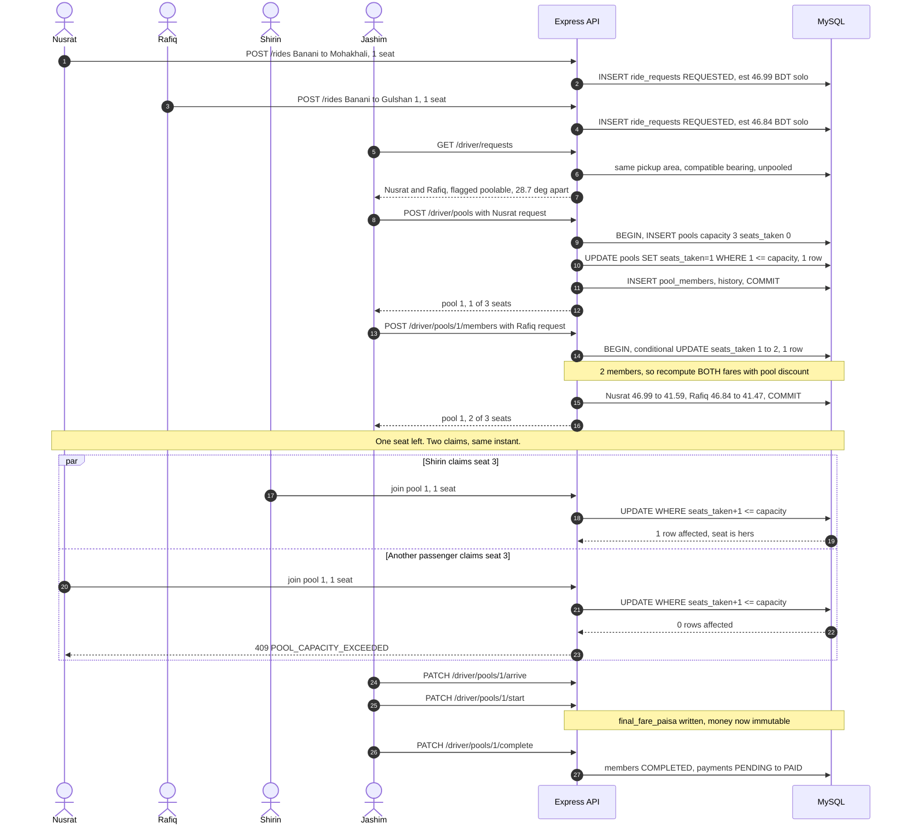

# Dhaka Tesla Pool

> Share a seat. Split the fare. Survive Dhaka traffic.

A ride-pooling MVP: passengers request rides across Dhaka, and when their routes are
compatible they share one three-seat battery rickshaw — each paying their own
discounted fare, without the vehicle ever being overbooked.

> **Status: in development.** Sections marked _TODO_ are not implemented yet. The
> [roadmap](#roadmap) shows exactly where things stand.

**Live demo:** _TODO_ · **Demo video:** _TODO_

---

## Contents

- [The problem](#the-problem)
- [Features](#features)
- [Screenshots](#screenshots)
- [Architecture](#architecture)
- [The ride lifecycle](#the-ride-lifecycle)
- [Pooling: the matching rule](#pooling-the-matching-rule)
- [Fare model](#fare-model)
- [Concurrency: two people, one seat](#concurrency-two-people-one-seat)
- [Database design](#database-design)
- [Tech stack and why](#tech-stack-and-why)
- [Project structure](#project-structure)
- [Getting started](#getting-started)
- [Environment variables](#environment-variables)
- [Migrations and seed data](#migrations-and-seed-data)
- [Demo credentials](#demo-credentials)
- [Tests](#tests)
- [API reference](#api-reference)
- [Deployment](#deployment)
- [Known limitations](#known-limitations)
- [Next improvements](#next-improvements)
- [If Oi Tesla goes viral](#if-oi-tesla-goes-viral)
- [AI usage](#ai-usage)
- [Roadmap](#roadmap)

---

## The problem

At 8:41 AM on Banani Road 11, Jashim is waiting in **Bullet** — his three-seat,
battery-powered, entirely unaffiliated "Tesla". Nusrat books a ride to Mohakhali.
Two minutes later Rafiq books an almost-identical route to Gulshan 1. The system has
about a second to decide whether those two can share a seat, split the fare fairly,
and get there without anyone being overcharged or double-booked. Then Shirin tries to
claim the last remaining seat thirty seconds later.

That last part is the interesting one: two people, one seat, both told it's
available. Exactly one must win. See
[Concurrency](#concurrency-two-people-one-seat).

The engineering problems worth solving here are not routing. They are:

- a seat may never be sold twice, even under a race,
- each passenger sees their own money and status and nobody else's,
- every state change must be explainable after the fact.

Everything in this design serves those three constraints.

## Features

### Passenger

- [x] Sign up and sign in
- [x] Request a ride: pickup area, destination, seat count
- [x] See an estimated fare before committing — solo price and shared price
- [x] Track status: requested → matched → driver arrived → in progress → completed
- [x] See who they are sharing with (first name and destination only, never fares)
- [x] View ride history
- [x] Cancel while the cancellation rules still allow it

### Driver

- [x] Sign in; go online and offline
- [x] Own one Tesla with a fixed seat capacity
- [x] See open requests, with each one flagged as poolable or not — and why not
- [x] Accept a request, then add compatible passengers to the same trip
- [x] Mark arrival, start the trip, complete it
- [x] See every passenger, their seats, their fares, and seats used against capacity
- [x] View trip history

### Pool

- [x] Several requests share one Tesla
- [x] Occupied seats can never exceed capacity — enforced in three independent places
- [x] Each passenger gets an individually calculated fare
- [x] Fares recalculate when the pool changes, and lock when the trip starts
- [x] Full audit trail of every status change, who caused it and when

## Screenshots

_TODO — passenger request form with the live fare quote, the ride tracker mid-pool, and
the driver's request board. Captured once the driver UI lands._

## Architecture



Three tiers, one datastore. No message broker, no cache, no second service.

Inside the API, dependencies point one way. Business rules live in the service
layer — never in a route handler, never in a React component.



The seat-capacity rule lives in exactly one function, in the service layer, inside a
transaction. It is not duplicated in a controller or re-checked in the UI.

### What we deliberately did not build

| Not used | Why not now | We would add it when |
| --- | --- | --- |
| Redis | Nothing needs a shared cache; one MySQL handles this read volume | Read latency on the driver feed becomes the bottleneck |
| Queues / Kafka | Every operation is synchronous and must be immediately consistent | Fare settlement or notifications become side effects |
| WebSockets | Status changes are seconds-scale; polling is honest and simpler | Live driver position on a map, or sub-second matching |
| Microservices | One team, one deploy, one transaction boundary | Matching needs to scale independently of auth |
| PostGIS | Twelve seeded areas; distance is arithmetic over twelve rows | Pickup becomes a free lat/lng instead of a fixed area |

## The ride lifecycle

The brief suggests one state machine and invites improvement if we can explain why.
We use **two**, because a passenger's journey and a vehicle's trip genuinely are
different things:

1. **They diverge.** Nusrat cancels; Rafiq is still riding in the same Tesla. One
   status column would have to be simultaneously `CANCELLED` and `STARTED`.
2. **Different actors, different events.** `DRIVER_ARRIVED` is a fact about the
   vehicle reaching the pickup zone. `COMPLETED` is a fact about one passenger being
   dropped off. Those are not stages of the same process.
3. **Cancellation is asymmetric.** If Jashim's pool dies, its passengers should
   return to `REQUESTED` and become matchable again — not be marked cancelled, which
   would read as though they gave up.
4. **The capacity rule needs a precise home.** `FORMING` is the only pool status
   that accepts members, so "can this request join?" is one status check plus one
   arithmetic comparison, both on a single row.

A single status column cannot express any of that without lying. We kept the brief's
status *names* on the request side so the mapping stays obvious; the UI renders
`STARTED` as "In progress".

<table>
<tr><th>RideRequest — one passenger's journey</th><th>Pool — one vehicle's trip</th></tr>
<tr><td>



</td><td>



</td></tr>
</table>

**Cancellation rules.** A passenger may cancel from `REQUESTED`, `MATCHED` or
`DRIVER_ARRIVED`. Once `STARTED` they are physically in the vehicle and the fare is
locked, so cancelling is meaningless and returns `409`. Cancelling releases the seat
back to the pool in the same transaction and recomputes the remaining members' fares
— if Nusrat leaves and Rafiq is alone again, Rafiq's discount goes away.

<details>
<summary><b>Full pooling sequence — the Banani scenario end to end</b></summary>



Step 12 is the interesting one. Adding Rafiq changes *Nusrat's* price, because the
discount only becomes real once someone shares the distance. That recompute happens
inside the same transaction as the seat claim, so a passenger can never be charged a
pooled fare for a pool they failed to join.

</details>

## Pooling: the matching rule

Two requests may share a Tesla when **all** of the following hold:

1. **Same pickup area** — identical `pickup_area_id`.
2. **Compatible direction** — the initial bearing from pickup to each dropoff differs
   by no more than `POOL_MAX_BEARING_DIFF_DEG` (default **45°**).
3. **Seats available** — `seats_taken + seats_requested <= capacity`.
4. **Pool still open** — pool status is `FORMING`.
5. **Vehicle online** — the driver is accepting work.

### Worked example — the brief's own case

| | Bearing from Banani | Distance |
| --- | --- | --- |
| Nusrat → Mohakhali | 174.5° | 1.799 km |
| Rafiq → Gulshan 1 | 145.7° | 1.789 km |
| **Difference** | **28.7°** | ≤ 45°, so **pooled** ✅ |

And a case it correctly refuses: Banani → Uttara has a bearing of 344.5°, which is
**170.1°** away from Nusrat's — very nearly the opposite direction. Same pickup, but
nobody sensibly shares that ride.

**Why bearing, and not the obvious alternatives.** Same-destination-only would refuse
Nusrat and Rafiq, which is the exact pairing the brief asks us to support. A plain
distance-between-destinations threshold breaks down where it matters most: two
destinations 2 km apart are a reasonable detour if they are further along the same
road, and a terrible one if they are in opposite directions. Bearing captures "are we
going the same way", which is what actually determines whether sharing makes sense.
It is also cheap — two `atan2` calls, no routing service, no API key — and
reproducible by hand, so the numbers above can be checked with a calculator.

**Honest limitation.** Bearing is a straight-line heuristic. It knows nothing about
one-way roads, the Hatirjheel link, or the fact that Dhaka traffic makes a 2 km trip
take 25 minutes. It would happily pool two trips separated by a river. For twelve
fixed city-centre areas it behaves sensibly, and the brief explicitly says not to
rebuild Google Maps. With real lat/lng pickups this becomes a radius check plus a
detour ratio from a real routing engine.

## Fare model

```
distanceKm     = haversine(pickup, dropoff), rounded to 3 decimals
distanceCharge = roundHalfUp(FARE_PER_KM_PAISA × distanceKm)
poolDiscount   = pooled ? roundHalfUp(distanceCharge × FARE_POOL_DISCOUNT_PCT / 100) : 0
perSeatFare    = FARE_BASE_PAISA + distanceCharge − poolDiscount
passengerFare  = perSeatFare × seatsRequested
```

Defaults, all overridable by environment variable so the model can be re-tested
without touching code: base **2000** paisa (20 BDT), per km **1500** paisa (15 BDT),
pool discount **20%**.

### Worked example — Nusrat and Rafiq, checkable by hand

| | Nusrat (Banani → Mohakhali) | Rafiq (Banani → Gulshan 1) |
| --- | --- | --- |
| distance | 1.799 km | 1.789 km |
| distanceCharge | 1500 × 1.799 = **2699** | 1500 × 1.789 = **2684** |
| base | 2000 | 2000 |
| **solo fare** | 4699 paisa = **46.99 BDT** | 4684 paisa = **46.84 BDT** |
| pool discount (20% of distance) | 540 | 537 |
| **pooled fare** | 4159 paisa = **41.59 BDT** | 4147 paisa = **41.47 BDT** |
| saving | 5.40 BDT | 5.37 BDT |

Jashim collects **83.06 BDT** for one trip instead of 46.99 BDT, while both
passengers pay less than they would alone. That is the whole product in one table.

**Why the discount applies to distance only, never the base fare.** The base fare
represents the cost of the pickup itself — Jashim's time getting there, the stopping
and waiting — and that does not get cheaper because a second passenger climbs in.
What genuinely is shared is the distance travelled together, so discounting only the
distance component means the discount corresponds to something real. It also keeps
the driver's floor intact: however many people share, Jashim earns at least 20 BDT
per passenger.

**Why fares re-quote.** `estimated_fare_paisa` is the solo quote at request time,
because at that moment nobody knows whether a pool will form. When a second member
joins, both members' fares are recomputed inside the same transaction as the seat
claim. At `STARTED` the value is copied to `final_fare_paisa` and never changes
again. So a passenger can never be charged a pooled rate for a pool they failed to
join, and cannot have their price change once they are in the vehicle.

**Rounding** is half up, applied at each of the two places a fraction can appear
(distance charge and discount), never only at the end. Banker's rounding would be
better for a system aggregating millions of transactions without bias; half up is
easier for an evaluator to reproduce mentally, and at this scale the bias is
irrelevant.

### Payments

No gateway, as the brief allows. `CASH` is a record that the driver collected it;
`TESLAPAY` debits a simulated wallet and writes a ledger row.

Payments are raised when the trip **starts**, not when the ride is requested — the
amount is not knowable until the fare locks, and a payment row carrying a figure that
could still change would be a receipt for a price nobody agreed to. They settle on
completion.

The debit is the same shape as the seat claim, for the same reason:

```sql
UPDATE wallets SET balance_paisa = balance_paisa - :amount
 WHERE user_id = :payer AND balance_paisa >= :amount;
```

Reading the balance and then writing it would let two concurrent debits both pass an
affordability check and overdraw. `balance_paisa` is also `BIGINT UNSIGNED`, so MySQL
would reject the subtraction even without the guard.

**A wallet shortfall does not block completion.** That one payment is marked `FAILED`
with reason `INSUFFICIENT_WALLET_BALANCE`, and the trip still completes. Refusing to
complete would strand the driver over someone else's balance with passengers already
delivered — a failed TeslaPay payment is a debt to collect in cash, not a reason to
hold a trip open. The response's `meta.settlement` itemises every line so the driver
knows who still owes.

This is why Shirin's seeded balance is 45.00 BDT: her solo fare (46.99) fails and her
pooled fare (41.47) succeeds, so both paths are demonstrable without editing data.

### How money is stored

Every monetary value is a **`BIGINT` count of paisa**. 100 paisa = 1 BDT. Never a
float, never a decimal.

This app divides money — a pool discount is a percentage, and percentages of odd
amounts produce fractions that have to land somewhere. With integers, "somewhere" is
a decision made explicitly once, at a documented point, and every later addition and
comparison is exact. Floats fail outright: `0.1 + 0.2 !== 0.3`, and a fare that fails
an equality assertion in a test is a fare you cannot reconcile in production either.

`DECIMAL(10,2)` is genuinely defensible and is what many payment systems use. We did
not pick it because it pushes exactness onto the caller: a JavaScript client reading a
`DECIMAL` gets a string, and the moment anyone does arithmetic on it without a decimal
library the exactness is gone. Integers cannot be misused that way — `4159` is
unambiguously 41.59 BDT in every language. Formatting to Taka happens in exactly one
helper, at the presentation layer.

Multi-currency would change this: per-currency minor-unit exponents (JPY has none,
KWD has three) make a bare integer ambiguous, and the type would become
`{ amount, currency }`.

## Concurrency: two people, one seat

Bullet has one seat left. Nusrat and Shirin both try to claim it, and both were shown
one seat available.

A read-then-write would let both read `2`, both compute `3`, and both write. So there
is no read. The claim is a single conditional statement:

```sql
UPDATE pools
   SET seats_taken = seats_taken + :seats
 WHERE id = :poolId
   AND status = 'FORMING'
   AND seats_taken + :seats <= capacity;
-- affectedRows === 0  →  409 POOL_CAPACITY_EXCEEDED
```

That statement is its own critical section. InnoDB takes an exclusive row lock to
perform the write, and the `WHERE` clause is evaluated against committed state at
that moment — so the second writer evaluates `3 + 1 <= 3`, matches nothing, and
reports zero affected rows. The loser learns it lost from the row count, which becomes
a `409`.

**Why not `SELECT ... FOR UPDATE`.** It closes the same gap correctly and is a
perfectly good answer, but it needs two round trips and forces us to reason about lock
ordering as soon as a transaction touches more than one row. One conditional statement
needs neither.

**That statement also does a second job.** InnoDB holds the exclusive row lock it took
for the write until the transaction commits, so any other join targeting the same pool
blocks on it. Everything *after* the claim in the same transaction is therefore
effectively serialised per pool — which is what lets the matching rule read a stable
member list immediately afterwards.

That ordering matters, and it is why the seat is claimed *before* the route is
confirmed. The matching rule compares a candidate against every existing member, so
two passengers each compatible with the pool as it stood may not be compatible with
each other. Validating before the lock would leave that race open; validating after it
closes it, and throwing then rolls the seat claim back along with everything else. The
pre-flight check that runs first exists only to give the driver a specific reason —
"wrong direction", "different area" — rather than a bare capacity failure.

**Defence in depth.** Three independent layers, so the invariant holds even if one is
wrong:

| Layer | Mechanism | What it catches |
| --- | --- | --- |
| Application | Atomic conditional `UPDATE`; zero affected rows means `409` | The read-then-write race |
| Schema | `CHECK (seats_taken <= capacity)` on `pools` | A bug in any future code path, or a manual `UPDATE` |
| Schema | `UNIQUE (pool_id, ride_request_id)` on `pool_members` | A retry or double-click booking a second seat in the same pool |

**Isolation level** is the default `REPEATABLE READ`. We do not rely on the snapshot
for the seat check, because the conditional `UPDATE` reads current committed state
rather than the transaction snapshot — which is exactly the behaviour wanted here.

**Verified by** a test that fires two genuinely concurrent joins at a
one-seat-remaining pool and asserts exactly one `201` and one `409`, plus a
reconciliation assertion that `seats_taken` equals `SUM(seats)` over active members.

**At larger scale** the hot row becomes the contention point: every claim on one pool
serialises on it. That is correct, but it caps throughput per pool. We would keep the
invariant in the database — it is the only place that can actually guarantee it — and
reduce the number of contenders reaching it: partition matching by pickup zone so
claims spread across many pool rows, hold a short-lived reservation before
confirmation so the UI stops offering seats already being claimed, and make joins
idempotent on a client-supplied key so retries after a timeout are free. What we would
**not** do is move the check into an application cache. A cache cannot promise a seat.

## Database design

MySQL 8, InnoDB throughout. Eleven tables.

```mermaid
erDiagram
    users ||--o| vehicles : "drives"
    users ||--o{ ride_requests : "places"
    users ||--o{ pools : "operates"
    users ||--o| wallets : "holds"
    users ||--o{ refresh_tokens : "authenticates with"

    areas ||--o{ ride_requests : "pickup"
    areas ||--o{ ride_requests : "dropoff"
    areas ||--o{ pools : "pickup zone"

    vehicles ||--o{ pools : "is used for"

    pools ||--|{ pool_members : "contains"
    ride_requests ||--o| pool_members : "is seated by"

    ride_requests ||--o{ ride_status_history : "logs"
    pools ||--o{ ride_status_history : "logs"

    ride_requests ||--o| payments : "settles via"
    wallets ||--o{ wallet_transactions : "ledgers"

    users {
        bigint id PK
        varchar name
        varchar email UK
        varchar phone UK
        varchar password_hash
        enum role "PASSENGER | DRIVER"
        boolean is_active
        datetime created_at
    }
    refresh_tokens {
        bigint id PK
        bigint user_id FK
        char token_hash UK "sha256, never the raw token"
        datetime expires_at
        datetime revoked_at
    }
    vehicles {
        bigint id PK
        bigint driver_id FK,UK "one Tesla per driver"
        varchar name "Bullet"
        varchar plate_no UK
        tinyint capacity "3 for Bullet"
        boolean is_online
    }
    areas {
        smallint id PK
        varchar name UK "Banani, Mohakhali, ..."
        decimal latitude "DECIMAL(9,6)"
        decimal longitude "DECIMAL(9,6)"
        boolean is_active
    }
    ride_requests {
        bigint id PK
        bigint passenger_id FK
        smallint pickup_area_id FK
        smallint dropoff_area_id FK
        tinyint seats_requested
        enum status "REQUESTED..COMPLETED | CANCELLED"
        decimal distance_km "snapshot at request time"
        bigint estimated_fare_paisa "solo quote"
        bigint final_fare_paisa "locked at STARTED"
        bigint cancelled_by FK
        varchar cancel_reason
        datetime requested_at
        datetime completed_at
    }
    pools {
        bigint id PK
        bigint vehicle_id FK
        bigint driver_id FK "denormalised for the driver feed"
        smallint pickup_area_id FK "the matching anchor"
        enum status "FORMING..COMPLETED | CANCELLED"
        tinyint capacity "snapshot of vehicle.capacity"
        tinyint seats_taken "CHECK <= capacity"
        datetime created_at
        datetime started_at
    }
    pool_members {
        bigint id PK
        bigint pool_id FK
        bigint ride_request_id FK,UK "one pool per request, ever"
        tinyint seats
        bigint fare_paisa "this member's current fare"
        datetime joined_at
        datetime left_at "set on cancel, row kept for audit"
    }
    ride_status_history {
        bigint id PK
        bigint ride_request_id FK "nullable"
        bigint pool_id FK "nullable"
        varchar from_status
        varchar to_status
        bigint actor_user_id FK
        enum actor_role "PASSENGER | DRIVER | SYSTEM"
        datetime created_at "DATETIME(3)"
    }
    payments {
        bigint id PK
        bigint ride_request_id FK,UK
        bigint payer_id FK
        bigint amount_paisa
        enum method "CASH | TESLAPAY"
        enum status "PENDING | PAID | FAILED"
    }
    wallets {
        bigint id PK
        bigint user_id FK,UK
        bigint balance_paisa "CHECK >= 0"
    }
    wallet_transactions {
        bigint id PK
        bigint wallet_id FK
        enum direction "CREDIT | DEBIT"
        bigint amount_paisa
        bigint balance_after_paisa "makes the balance auditable"
        bigint ride_request_id FK
    }
```



<details>
<summary><b>Every table, and why it exists</b></summary>

### `users`

One identity table with a `role` enum rather than separate `passengers` and `drivers`
tables. There is one login form, one password policy, one JWT shape and one
`users.id` for every foreign key to point at. Role-specific data is thin — the only
thing a driver has that a passenger does not is a vehicle, and that is its own table.

If driver onboarding grew real fields (licence number, NID, verification status,
payout account), those belong in a `driver_profiles` table keyed on `user_id`, not as
a dozen nullable columns here.

**Documented assumption:** a user is a passenger *or* a driver, not both. A real
product would model roles as a many-to-many, because Jashim may well want to book a
ride on his day off.

| Constraint / index | Reason |
| --- | --- |
| `UNIQUE (email)` | Login identity. Stored lowercased so `Nusrat@x.com` cannot become a second account. |
| `UNIQUE (phone)` | Same; nullable because phone is optional at signup. |
| `password_hash VARCHAR(255)` | argon2id output with parameters embedded; room to change cost factors without a migration. |

### `refresh_tokens`

Access tokens are stateless, so they cannot be revoked. If Nusrat logs out, or a
token leaks, something must be able to say no — that something is a row here.

Refresh tokens are **opaque 256-bit random values, not JWTs.** There is no point
signing something whose validity is decided by a database lookup anyway, and opaque
means unforgeable by construction: there is no algebra to attack, only a lookup that
either finds a live row or does not.

What is stored is an **HMAC-SHA256** of the token, keyed by `JWT_REFRESH_SECRET` —
not a bare hash. Both are irreversible for a 256-bit random input, but keying the
digest means a stolen database is not by itself enough to validate a captured token:
the attacker also needs the secret, which lives in the environment rather than in the
data. That is also why the two secrets must differ — the access signing key and this
one then have independent blast radius.

Rotation on every refresh means a stolen token is usable once at most. Replaying an
already-rotated token means either the real client or an attacker is reusing it and
we cannot tell which, so the safe response is to revoke **every** session for that
user and make them sign in again.

| Constraint / index | Reason |
| --- | --- |
| `UNIQUE (token_hash)` | Lookup key; stops a collision being silently accepted. |
| `INDEX (user_id, revoked_at)` | "Revoke every session for this user" on password change. |
| `ON DELETE CASCADE` | Deleting a user must not leave usable credentials behind. |

### `vehicles`

The Teslas. `capacity` lives here because it is a property of Bullet, not of a trip.
`driver_id` is `UNIQUE` because this MVP allows one Tesla per driver — enforcing that
in the schema rather than in code means the day we relax it is a deliberate migration
rather than an accident.

| Constraint / index | Reason |
| --- | --- |
| `UNIQUE (driver_id)` | Enforces one-vehicle-per-driver. |
| `UNIQUE (plate_no)` | Two Teslas cannot share a plate. |
| `CHECK (capacity BETWEEN 1 AND 8)` | A zero-seat or 500-seat rickshaw is corruption, not a valid state. |
| `INDEX (is_online)` | Matching only considers online vehicles. |

### `areas`

The predefined Dhaka zones — geography is twelve rows, as the brief's "don't fight
map APIs" instruction invites.

**Why a table and not a string column:** a foreign key makes "Banani" spelled one
way, forever. Free text gives you `Banani`, `banani` and `Bannani` within a week, and
the matching rule silently stops working because two requests from the same place no
longer compare equal.

**Why `DECIMAL(9,6)` and not `FLOAT`:** exact to roughly 11 cm. Distance feeds fare,
and fare must be reproducible — if the evaluator recomputes Nusrat's 1.799 km by hand
they must get our answer. Floats make that a coin flip in the last decimal place.
`9,6` fits ±180.999999.

### `ride_requests`

One row per passenger journey; the passenger-facing state machine.

**Why `distance_km` is stored, not computed on read:** it is a snapshot. If someone
later corrects Mohakhali's coordinates, last month's completed rides must still
explain the fare actually charged. Recomputing on read would silently rewrite history.

**Why two money columns:** `estimated_fare_paisa` is the solo quote at request time,
before anyone knows whether a pool will form. `final_fare_paisa` is `NULL` until
`STARTED`, then written once and never touched. The gap between them *is* the pool
discount, and keeping both makes it visible.

**Why there is no `pool_id` column:** membership lives in `pool_members` and nowhere
else. A denormalised `pool_id` would be a second place to update inside the seat-claim
transaction, and therefore a second place to get wrong.

| Constraint / index | Reason |
| --- | --- |
| `CHECK (pickup_area_id <> dropoff_area_id)` | A ride to where you already are is not a ride. |
| `CHECK (seats_requested BETWEEN 1 AND 4)` | Bounded by the largest vehicle allowed. |
| `INDEX (status, pickup_area_id)` | The driver feed. Leading `status` because it is more selective once history accumulates. |
| `INDEX (passenger_id, requested_at DESC)` | Ride history, newest first, no sort needed. |

### `pools`

One row per vehicle trip; the driver-facing state machine, and the row the
concurrency control locks.

**Why `capacity` is duplicated from `vehicles`:** a snapshot, for the same reason as
`distance_km`. If Jashim rebuilds Bullet with four seats, a pool that ran last week
was still a three-seat pool, and the `CHECK` must be judged against the capacity that
applied. It also means the invariant is checkable within a single row with no join —
which is what makes the atomic conditional `UPDATE` possible at all.

**Why `driver_id` is here as well as reachable through `vehicles`:** the driver's feed
queries `(driver_id, status)` on every poll, and the alternative is a join on every
request to serve data that cannot change — a vehicle does not switch owners mid-trip.
Deliberate denormalisation, with a foreign key so it cannot drift.

| Constraint / index | Reason |
| --- | --- |
| **`CHECK (seats_taken <= capacity)`** | **The core invariant.** Last line of defence for the overbooking rule. |
| `CHECK (seats_taken >= 0)` | Releasing a seat twice would otherwise underflow. |
| `INDEX (driver_id, status)` | Jashim's active trip and history. |
| `INDEX (status, pickup_area_id)` | Finding `FORMING` pools a request could join. |

### `pool_members`

The junction table, and the answer to "obvious pool membership". It carries
`fare_paisa` because fare is a property of *this passenger in this pool* — the same
request would cost more riding solo.

**Why cancelled members keep their row:** `left_at` is set rather than the row being
deleted. Deleting it would erase the fact that Nusrat was ever in the pool, which
breaks the "explain exactly what happened" requirement. It also gives a
reconciliation check worth testing: `seats_taken` must always equal
`SUM(seats) WHERE left_at IS NULL`.

| Constraint / index | Reason |
| --- | --- |
| `UNIQUE (pool_id, ride_request_id)` | Idempotency: a retried or double-clicked join cannot book a second seat in the same pool. |
| `INDEX (pool_id, left_at)` | The active-member list the driver sees. |

**The unique is composite, not global on `ride_request_id` — and that distinction was
a bug found by running the tests.** A global unique reads as "a request belongs to one
pool, ever", which directly contradicts requeueing: when a driver cancels a pool its
members return to `REQUESTED` and must be able to join a *different* Tesla. With the
global unique in place the old membership row permanently occupied the only slot, so a
requeued passenger could never be picked up again — the feature was silently useless.

Exclusivity across pools is enforced where it actually belongs: the atomic
`REQUESTED → MATCHED` transition, which only one claimant can win. The historical rows
stay, so the audit trail is intact.

### `ride_status_history`

Append-only audit trail; nothing is ever updated or deleted. This is why the system
can answer "why was Nusrat charged 41.59 when she was quoted 46.99".

**Why `from_status`/`to_status` are `VARCHAR` and not the `ENUM`:** an audit log has
to outlive the schema. If a future migration renames or drops a status, a column typed
as that enum would either block the migration or silently rewrite history. Text is the
right trade-off for a historical record.

**Why `actor_role` includes `SYSTEM`:** some transitions have no human behind them — a
pool cancelled by the driver pushes its members back to `REQUESTED`, and that is the
system acting, not the passenger.

| Constraint / index | Reason |
| --- | --- |
| `CHECK (ride_request_id IS NOT NULL OR pool_id IS NOT NULL)` | Every entry must describe something. |
| `INDEX (ride_request_id, created_at)` | Rendering one ride's timeline in order. |
| `DATETIME(3)` | Millisecond precision. Two transitions in the same second must still be orderable — which matters precisely in the Shirin race. |

### `payments`

Settlement record, one per ride request. `UNIQUE (ride_request_id)` because a ride is
paid once. `amount_paisa` is copied from `final_fare_paisa` at settlement rather than
referenced, so a receipt is self-contained. `CASH` or `TESLAPAY`; no gateway, as the
brief allows.

### `wallets` and `wallet_transactions`

Simulated TeslaPay. `wallets` holds the balance; `wallet_transactions` is the ledger
explaining it.

**Why both:** a bare balance column is unauditable. When Nusrat asks why she has 120
BDT left, the only honest answer comes from a ledger. `balance_after_paisa` on each row
means any disagreement between ledger and balance is immediately detectable rather
than a mystery.

Overdrafts are structurally impossible because `balance_paisa` is
`BIGINT UNSIGNED`: MySQL in strict mode rejects the subtraction outright rather
than wrapping, so "insufficient funds" is enforced by the column type and not only
by a service someone might refactor around. No redundant `CHECK (>= 0)` is added
for the same reason — the type already says it.

### Conventions

- Surrogate `BIGINT UNSIGNED AUTO_INCREMENT` primary keys throughout. Natural keys
  (email, plate) get unique indexes instead, so they can be corrected without
  cascading.
- `utf8mb4` / `utf8mb4_unicode_ci` — Bengali names and place names must round-trip.
- Timestamps are `DATETIME` in UTC, formatted to Asia/Dhaka in the UI. Storing local
  time is how you lose an hour twice a year.
- Foreign keys are `RESTRICT` on reference data (areas, users) and `CASCADE` only where
  the child cannot outlive the parent (refresh tokens, history).

</details>

## Tech stack and why

Mandated by the brief: Next.js/React frontend, Node.js backend. Chosen here: MySQL.

| Layer | Choice | Alternatives considered | Why this one |
| --- | --- | --- | --- |
| Backend | **Express 5** + TypeScript | NestJS, Fastify, Hono | Almost no behaviour of its own, so every abstraction here is ours to defend. Express 5 handles async errors natively, removing the `asyncHandler` wrapper v4 needed. |
| API style | **REST** | GraphQL, tRPC | Operations are verbs against small resources, and `409 Conflict` is exactly right when Shirin loses the race. Two known clients means GraphQL's flexibility buys nothing. |
| ORM | **Prisma** | Drizzle, Knex, raw `mysql2` | Most dependable migrations, and schema-derived types make a column rename a compile error. |
| Validation | **Zod** | Joi, class-validator, express-validator | One schema yields both the runtime check and the TS type via `z.infer`, so they cannot drift. |
| Auth | **argon2id** + JWT access (15m) + rotating **opaque** refresh (7d), both in `httpOnly` cookies | Server sessions, access-token-only, Clerk/Auth0 | Stateless verification for the polled endpoints, stateful revocation where logout must mean something. |
| Tests | **Vitest** + Supertest | Jest, node:test, Testcontainers | Native TS/ESM with no transform config. Real MySQL, because the risky behaviours *are* database behaviours. |
| Logging | **Pino** + request IDs | Winston, console | Structured JSON, low overhead, and every error response carries a `requestId` that matches a log line. |
| Frontend | **Next.js 15** App Router + Tailwind + TanStack Query | CRA/Vite, CSS Modules, MUI, SWR | Query handles polling, caching and loading/error states, which is most of this UI's behaviour. |
| Styling | **Tailwind** | CSS Modules, MUI, shadcn/ui | Consistent spacing and colour, no runtime cost. A component library would be heavier than the app. |

<details>
<summary><b>The reasoning in full, with switch-triggers</b></summary>

**Express 5 over NestJS.** The thing being graded is ownership — the brief says be
ready to explain, debug and redesign any part live. NestJS would hand us module
boundaries and DI for free, but also decorators, providers and a request lifecycle
that are someone else's design; "the framework does that" is a bad answer in an
interview about your own architecture. Fastify is meaningfully faster, but this MVP is
bound by a single MySQL round trip per request, not HTTP parsing, so the win is
unmeasurable. *Switch when:* several developers need module boundaries enforced rather
than agreed (NestJS), or profiling shows serialisation as the bottleneck (Fastify).

**REST over GraphQL.** GraphQL's strength is letting clients shape arbitrary reads; we
have two known clients and roughly fifteen known queries, so that flexibility costs
N+1 risk, query-depth limiting, and a harder time putting authorization in one place.
tRPC would give end-to-end types but couples the frontend to backend internals and
makes the API hard to exercise with `curl` — which an evaluator will want to do.
*Switch when:* a third client with genuinely different data needs appears.

**Prisma, with an honest caveat.** Prisma's schema language has no `CHECK` constraint
syntax, and `CHECK (seats_taken <= capacity)` is the single most important line in
this database. We handle that by writing the constraint into the generated migration
SQL by hand. That is a real limitation, not a detail — but the alternative is giving up
Prisma's migration tooling to gain syntax for three constraints. Drizzle was the close
second and would have expressed both the constraints and the conditional `UPDATE` more
naturally; it lost on migration maturity, which the brief weights more heavily.
*Switch when:* most non-trivial queries need `$queryRaw` — at that point the ORM has
stopped paying for itself.

**argon2id over bcrypt.** Current password-hashing recommendation, memory-hard as well
as CPU-hard, so it resists GPU attack better. bcrypt would be perfectly responsible;
there was no reason to prefer the older primitive.

**`httpOnly` cookies over `localStorage`.** JavaScript must not be able to read a
credential — an XSS bug should not be an account takeover.

The usual cost of cookies is CSRF exposure, and deployed there is a second problem:
Vercel and Render are different sites, so the browser would only attach cookies
cross-site if they were marked `SameSite=None` — which removes exactly the protection
`SameSite` exists to give, leaving the CORS allowlist as the only defence.

**Both problems are solved by proxying the API through the frontend.** A Next.js
route handler sends `/api/*` to the backend server-side, so from the browser's point of
view everything is same-origin: cookies stay `SameSite=Lax`, CORS never enters the
picture, and the API's real hostname is never exposed to the client. The cost is one
extra network hop, which is a fair price for not weakening cookie policy. See
[`frontend/src/app/api/[...path]/route.ts`](frontend/src/app/api/%5B...path%5D/route.ts).

**Why a route handler and not a `rewrites()` entry**, which would be the obvious choice:
Next resolves rewrites when the config is *built* and bakes the destination into the
standalone output. An image built without `API_PROXY_TARGET` set therefore ships a
hardcoded `localhost:4000` — which, inside the web container, points at the web
container itself. That failed exactly that way the first time the stack came up. A route
handler reads the environment per request, so one image works locally, in Compose and on
Vercel.

Two details in that handler are easy to get wrong and both break sign-in silently.
Hop-by-hop headers (`connection`, `transfer-encoding`, `host`, `content-length`) are
stripped rather than forwarded, since they describe this connection and not the request.
And `Set-Cookie` is appended per value rather than set, because `Headers.set` collapses
repeats into one comma-joined string that browsers reject — and the auth flow sends two
cookies.

**A hosted auth provider** was rejected because authentication is explicitly one of the
things being assessed. Outsourcing it would remove exactly the code we are meant to be
able to explain. *Switch when:* social login, SSO or MFA are required.

**Real MySQL in tests, not SQLite.** The things most worth testing here are the `CHECK`
constraint, the unique index, and two concurrent writers racing for a row. SQLite
exercises none of them. Testcontainers would give per-run isolation but adds
Docker-in-test complexity for a gain we do not need when Compose already provides a
database.

**Polling over WebSockets.** State changes here are human-paced: a driver accepting,
arriving, starting. Seconds of latency is invisible. A WebSocket layer would add
connection lifecycle, reconnection, auth on upgrade, and a second delivery path for
state the REST API already owns. *Switch when:* live driver position on a map — and
then SSE first, being one-directional and simpler.

**TypeScript with `strict` on.** Three things here are typed in a way that catches real
mistakes: the status unions (a transition function cannot be handed a status that does
not exist), the paisa money type, and the DTOs shared in shape between API and forms.
Ride state transitions are precisely where a typo becomes a silent bug.

</details>

## Project structure

```
.
├── backend/                 Node.js + Express + TypeScript API
│   ├── prisma/              schema, migrations, seed
│   ├── src/
│   │   ├── config/          env parsing and validation
│   │   ├── middleware/      auth, request id, errors, rate limit
│   │   ├── modules/         auth, rides, pools, driver, areas
│   │   │   └── <module>/    routes, controller, service, schema
│   │   ├── lib/             fare engine, geo, state machine, money
│   │   └── server.ts
│   ├── tests/
│   └── Dockerfile
│   ├── Dockerfile           multi-stage, non-root, health-checked
│   ├── docker-entrypoint.sh migrate → seed → exec server
│   └── .dockerignore
├── frontend/                Next.js App Router
│   ├── Dockerfile           standalone output, non-root, health-checked
│   ├── src/app/api/         runtime proxy to the API (same-origin cookies)
│   ├── src/middleware.ts    coarse redirects for signed-in/out sections
│   ├── src/app/             routes
│   ├── src/components/      ui primitives and the signed-in shell
│   ├── src/hooks/           session
│   ├── src/providers/       TanStack Query client
│   └── src/lib/             api client, wire types, formatters
├── docker/
│   └── mysql/init/          runs once on first database boot
├── docker-compose.yml
├── .env.example
└── README.md
```

Each backend module owns its routes, controller, service and Zod schemas. Shared
domain logic — fare calculation, haversine and bearing, the state machines, money
formatting — lives in `lib/` as pure functions, which is what makes them
straightforward to test without a database.

## Getting started

### Prerequisites

- **Docker Desktop** with Compose v2 — the only hard requirement
- Node.js 22+ and npm, if you want to run either side outside Docker

### Run everything

```bash
git clone https://github.com/Shawcha20/Dhaka_tesla.git
cd Dhaka_tesla
cp .env.example .env
# Generate two DIFFERENT secrets and paste them into .env:
openssl rand -hex 32   # JWT_ACCESS_SECRET
openssl rand -hex 32   # JWT_REFRESH_SECRET

docker compose up --build
```

That is the whole setup. In order, Compose:

1. starts **MySQL 8.0** with strict mode and `utf8mb4` explicitly set,
2. creates the separate test database on first boot,
3. holds the API back until MySQL passes a real `mysqladmin ping` — not a port
   check, because MySQL accepts TCP connections well before it can serve queries,
4. applies migrations with `prisma migrate deploy`,
5. seeds Jashim, Bullet, Nusrat, Rafiq and Shirin plus the twelve Dhaka areas,
6. starts the API and begins health-checking `/ready`,
7. holds the frontend back until the API is healthy, so the first page load cannot
   land before the database is migrated and seeded.

| Service | URL |
| --- | --- |
| **App** | **http://localhost:3000** |
| API | http://localhost:4000/api/v1 |
| Health / readiness | http://localhost:4000/health · http://localhost:4000/ready |
| MySQL | `127.0.0.1:3306` |

All three containers report a real health check, so `docker compose ps` showing
`healthy` means the stack is genuinely serving rather than merely running.

A quick check that it worked:

```bash
curl http://localhost:4000/ready
curl http://localhost:4000/api/v1/areas
```

### Walking the whole story without a UI

```bash
node backend/scripts/demo-flow.mjs
```

Drives the brief's Banani scenario end to end against the running API and prints a
readable transcript: Nusrat and Rafiq request overlapping trips, Jashim sees both
flagged poolable with the bearing difference that decided it, pools them into Bullet,
both fares drop, Shirin is refused the seat that no longer exists, and the trip runs to
completion with payments settled. It is re-runnable — it clears state from a previous
run first — and it asserts as it goes, so a wrong number fails rather than scrolls past.

<details>
<summary><b>Sample output</b></summary>

```
04. Nusrat prices Banani to Mohakhali before committing
    distance 1.799 km
    alone 46.99 BDT, shared 41.59 BDT

07. Jashim goes online and looks at what is waiting
    Nusrat → Mohakhali: 1 seat, 41.59 BDT if shared, bearing 174.5° — poolable
    Rafiq → Gulshan 1: 1 seat, 41.47 BDT if shared, bearing 145.7° — poolable

09. Jashim checks whether Rafiq can share the ride
    Rafiq: compatible, 28.7° apart from the pool

10. Jashim adds Rafiq — and both fares change
    pool #1 — 2/3 seats
    Nusrat Jahan → Mohakhali: now 41.59 BDT
    Rafiq Hasan → Gulshan 1: now 41.47 BDT
    Jashim collects 83.06 BDT for one trip

11. Nusrat sees her own new price, and who she is sharing with
    her fare: 41.59 BDT (quoted 46.99 BDT)
    companions: [{"name":"Rafiq","dropoffArea":"Gulshan 1","seats":1}]

12. Shirin tries to claim two seats — only one is left
    409 POOL_CAPACITY_EXCEEDED — Not enough seats left.

13. Jashim arrives, starts the trip — fares lock here — and completes it
    Nusrat Jahan: 41.59 BDT by TESLAPAY — PAID
    Rafiq Hasan: 41.47 BDT by CASH — PAID

15. Jashim's trip history
    trip #1: COMPLETED, 2 passenger(s), 2/3 seats (67%), earned 83.06 BDT
```

</details>

### Running the frontend in development

Compose already serves the frontend, but for hot reload:

```bash
docker compose up -d mysql api    # backend only
cd frontend
npm install
npm run dev                       # http://localhost:3000
```

It calls `/api/v1/...` relatively and the route handler proxies that to the API, so no
CORS configuration is involved and the auth cookies are same-origin. Point it elsewhere
with `API_PROXY_TARGET` (default `http://localhost:4000`).

The demo walkthrough can be driven through either entry point, which is a useful way to
confirm the proxy itself is working:

```bash
API_BASE_URL=http://localhost:3000/api/v1 node backend/scripts/demo-flow.mjs
```

### Running outside Docker

The API can run on the host against the containerised database — useful for
debugging, and how the test suite runs.

```bash
docker compose up -d mysql        # database only
cd backend
npm install
npm run prisma:generate
npm run prisma:deploy
npm run db:seed
npm run dev
```

`.env` points `DATABASE_URL` at `127.0.0.1` for exactly this reason. The api
container ignores it and builds its own URL with the hostname `mysql`, because
inside the Compose network the service name is the host.

### Notes on the image

- **Multi-stage build**, so TypeScript, Vitest and ESLint never reach the runtime
  image.
- **Runs as the unprivileged `node` user**, not root.
- **Debian slim rather than Alpine**: Prisma's query engine needs a musl-specific
  build and OpenSSL wiring that is a recurring source of runtime surprises. The
  extra tens of megabytes buy a predictable image.
- **`exec` in the entrypoint**, so Node becomes PID 1 and receives `SIGTERM`
  directly — without it the shell swallows the signal and the graceful shutdown
  never runs.
- **`migrate deploy`, never `migrate dev`**: the latter tries to create a shadow
  database and can prompt, neither of which belongs in a non-interactive start.
- **Seeding is opt-in** via `SEED_ON_START`, on in Compose and off by default in
  the image. It is idempotent, so repeating it is harmless, but a real deployment
  should not reseed on every boot.

## Environment variables

Copy the template and fill in real values:

```bash
cp .env.example .env
```

Every variable is documented inline in [`.env.example`](.env.example). No real secrets
are committed to this repository. Generate each secret with `openssl rand -hex 32`.

`JWT_ACCESS_SECRET` signs the access JWT; `JWT_REFRESH_SECRET` keys the HMAC that
refresh tokens are stored under. They must be **different**, and the API refuses to
start if they match — reusing one value collapses the blast radius of a leak of
either. In production it also refuses to start on a placeholder secret or a wildcard
CORS origin, because a misconfiguration that boots successfully just fails later, in
front of a user.

Fare constants (`FARE_BASE_PAISA`, `FARE_PER_KM_PAISA`,
`FARE_POOL_DISCOUNT_PCT`) and the matching threshold
(`POOL_MAX_BEARING_DIFF_DEG`) are environment variables specifically so the model can
be re-tested by hand without touching code.

## Migrations and seed data

`docker compose up` runs both automatically. To drive them by hand:

```bash
cd backend
npm run prisma:generate     # regenerate the typed client from the schema
npm run prisma:deploy       # apply migrations (use this in containers and CI)
npm run db:seed             # idempotent: safe to re-run
```

Changing the schema during development instead uses `npm run prisma:migrate`,
which creates a new migration and applies it. `npm run db:reset` drops, re-migrates
and re-seeds.

**The `CHECK` constraints are hand-written.** Prisma's schema language has no
syntax for them, so the generated migration SQL is followed by a hand-authored
block adding nine constraints — most importantly
`CHECK (seats_taken <= capacity)`. They are clearly marked in
[`prisma/migrations/20260924000000_init/migration.sql`](backend/prisma/migrations/20260924000000_init/migration.sql);
everything above the marker was produced by `prisma migrate diff`, so it matches
the schema exactly. This needs **MySQL 8.0.16+**: earlier versions parse `CHECK`
and silently ignore it, which would leave the overbooking guarantee resting on
application code alone.

Seed data uses the story cast, not placeholders: **Jashim** driving **Bullet**
(3 seats), with **Nusrat**, **Rafiq** and **Shirin** as passengers, plus twelve
Dhaka areas with real coordinates.

## Demo credentials

Password is the same for every account: **`TeslaPool#2026`**

| Role | Email | Notes |
| --- | --- | --- |
| Driver | `jashim@dhakatesla.test` | Owns Bullet — `DHA-TESLA-01`, 3 seats |
| Passenger | `nusrat@dhakatesla.test` | 500.00 BDT TeslaPay balance |
| Passenger | `rafiq@dhakatesla.test` | 500.00 BDT — pools with Nusrat from Banani |
| Passenger | `shirin@dhakatesla.test` | **45.00 BDT only** — enough for a pooled fare but not a solo one, so the `INSUFFICIENT_WALLET_BALANCE` path is demonstrable without editing data |

These are seeded demo accounts in a throwaway database. No real credentials appear
anywhere in this repository.

## Tests

```bash
cd backend
npm run test:db:deploy    # once: applies migrations to the test database
npm test                  # everything
npm run test:unit         # pure logic — no database needed
npm run test:integration  # HTTP level, needs MySQL running
npm run test:coverage
```

**Current status: 278 passing, 4 skipped** (the skipped four are the guards that only
run when no database is reachable). Verified against MySQL 8.0.46 in Docker.

The suite uses a **separate schema**, `dhaka_tesla_pool_test`, created automatically on
first database boot. It truncates every table between tests, so pointing it at the
development database would wipe the seeded demo data — `tests/setup.ts` throws rather
than let that happen. Integration suites skip themselves with a warning when no
database is reachable, so `npm test` still passes on a fresh clone with the unit suite
alone.

Unit tests run against no database at all, because the fare engine, the matching
rule, the geometry and the money arithmetic are deliberately pure functions with
config passed in. That means the hand-checkable numbers below are verified on every
run, and a developer with a fresh clone can check them before installing anything.

The suite targets what is actually risky, not a coverage number:

- Bullet's capacity can never be exceeded
- Two concurrent claims on the last seat produce exactly one winner
- `seats_taken` always reconciles against active members
- Invalid state transitions are rejected
- Nusrat's and Rafiq's pooled fares are correct to the paisa
- A passenger cannot read or modify another passenger's ride
- Cancellation rules hold, and cancelling releases the seat and re-prices the pool

## API reference

REST over JSON at `/api/v1`. Every 2xx body is `{ "data": ..., "meta": ... }`; every
error is:

```json
{
  "error": {
    "code": "POOL_CAPACITY_EXCEEDED",
    "message": "Bullet has 1 seat free but 2 were requested.",
    "requestId": "01JH2X4Q8N7B3K"
  }
}
```

`code` is stable and safe to branch on; `message` is human-facing. `requestId` matches
the `x-request-id` header and the server log line, so any reported error is traceable.

| | Endpoint | Purpose |
| --- | --- | --- |
| **Auth** | `POST /auth/register` | Passenger signup |
| | `POST /auth/login` | Sign in, sets cookies |
| | `POST /auth/refresh` | Rotate refresh token |
| | `POST /auth/logout` | Revoke and clear |
| | `GET /auth/me` | Current user, plus vehicle if driver |
| **Reference** | `GET /areas` | The twelve Dhaka zones |
| **Passenger** | `POST /rides/quote` | Fare estimate, solo and pooled |
| | `POST /rides` | Create a ride request |
| | `GET /rides/mine` | Own history, paginated |
| | `GET /rides/:id` | One ride: fare breakdown, pool, timeline |
| | `PATCH /rides/:id/cancel` | Cancel while valid |
| **Driver** | `PATCH /driver/status` | Go online / offline |
| | `GET /driver/requests` | Open requests, each flagged poolable or not |
| | `POST /driver/pools` | Accept a request, open a pool |
| | `POST /driver/pools/:id/members` | Add a passenger — the race-critical endpoint |
| | `GET /driver/pools/current` | Active trip: members, seats, fares |
| | `PATCH /driver/pools/:id/arrive` | `FORMING → DRIVER_ARRIVED` |
| | `PATCH /driver/pools/:id/start` | `→ STARTED`, fares lock |
| | `PATCH /driver/pools/:id/complete` | `→ COMPLETED`, payments settle; `meta.settlement` itemises each one |
| | `PATCH /driver/pools/:id/cancel` | Requeue members to `REQUESTED` |
| | `GET /driver/pools` | Trip history |
| **Ops** | `GET /health` · `GET /ready` | Liveness · readiness (`SELECT 1`) |

A note on status codes: asking for another passenger's ride returns **404**, not 403,
so the API does not confirm that someone else's ride id exists.

<details>
<summary><b>Error codes</b></summary>

| Code | Status | Meaning |
| --- | --- | --- |
| `VALIDATION_FAILED` | 400 | Body failed its Zod schema; see `details` |
| `INVALID_CREDENTIALS` | 401 | Wrong email or password — response does not say which |
| `UNAUTHENTICATED` | 401 | Missing or expired access token |
| `TOKEN_REUSE_DETECTED` | 401 | An already-rotated refresh token was presented |
| `FORBIDDEN_ROLE` | 403 | Passenger endpoint hit by a driver, or the reverse |
| `VEHICLE_OFFLINE` | 403 | Driver must be online |
| `RIDE_NOT_FOUND` | 404 | No such ride, or not this user's ride |
| `POOL_NOT_FOUND` | 404 | No such pool, or not this driver's pool |
| `EMAIL_ALREADY_REGISTERED` | 409 | Signup with a taken email |
| `PASSENGER_HAS_ACTIVE_RIDE` | 409 | One active ride per passenger |
| `DRIVER_HAS_ACTIVE_POOL` | 409 | One active pool per driver |
| `RIDE_ALREADY_MATCHED` | 409 | Another driver accepted it first |
| `POOL_CAPACITY_EXCEEDED` | 409 | No seats left — the race loser |
| `POOL_NOT_FORMING` | 409 | Pool no longer accepts members |
| `POOL_EMPTY` | 409 | Cannot start a trip with no passengers |
| `RIDE_NOT_CANCELLABLE` | 409 | Already started or already terminal |
| `INVALID_STATE_TRANSITION` | 409 | Not permitted by the state machine |
| `INSUFFICIENT_WALLET_BALANCE` | — | Not an HTTP error. Returned as a per-payment `failureReason` in `meta.settlement`; see [Payments](#payments) |
| `SAME_PICKUP_AND_DROPOFF` | 422 | Pickup and dropoff are the same area |
| `ROUTE_NOT_COMPATIBLE` | 422 | Bearing difference exceeds the threshold |
| `RATE_LIMITED` | 429 | Too many requests |
| `INTERNAL_ERROR` | 500 | Unexpected; logged, never returned in detail |

</details>

## Deployment

Free tiers only, as the brief requires — nothing here is paid for.

| Piece | Host | Note |
| --- | --- | --- |
| Frontend | Vercel | Native Next.js support |
| Backend | Render | Runs the same `backend/Dockerfile` Compose uses |
| Database | Aiven for MySQL (fallback: TiDB Serverless) | Managed, TLS |

**Why the backend is not on Vercel**, despite the frontend being there. Running Express
as a serverless function is possible, but it fights two things this app depends on.
Connection pooling: each cold invocation opens its own MySQL connections, and a
free-tier database with a low `max_connections` starts refusing them under any
concurrency. Transactions: the seat claim must complete on one connection, and a
platform that may freeze or recycle an instance mid-invocation is a poor host for it.
Neither is fatal with a database proxy in front, but that is a paid service or extra
infrastructure to solve a problem a container avoids for free.

**The free-tier cost, stated plainly:** Render sleeps an idle container, so the first
request after a quiet spell takes several seconds. That is a real consequence of not
paying, and the alternative was spending money the brief tells us not to spend.

## Known limitations

- **Matching is a straight-line heuristic.** Bearing knows nothing about one-way
  roads, rivers or traffic. Honest for twelve fixed areas; not a routing engine.
- **Geography is twelve fixed zones**, not arbitrary lat/lng pickups.
- **One active ride per passenger and one active pool per driver.** Simplifies state
  considerably; a real system would relax both.
- **A user is a passenger or a driver, never both.**
- **No mid-trip joins.** Once a pool starts, membership is frozen.
- **Status updates are polled**, so there is a few seconds of latency.
- **Free-tier cold starts** on the backend after idle periods.
- **Payment is simulated.** No gateway, as the brief allows.

## Next improvements

- Reservation-then-confirm on seat claims, so the UI stops offering seats that are
  already being claimed
- Idempotency keys on join and create, making client retries free
- SSE for status updates, replacing polling
- Real lat/lng pickups with a detour-ratio matching rule
- Driver ratings, and a cancellation-fee policy
- Observability: metrics on match rate, seat utilisation and `409` frequency

## If Oi Tesla goes viral

Reasoning about 1M passengers and 100k drivers, without building any of it now.

**The bottleneck is not the API, it is the hot pool row.** Every claim on one pool
serialises on a single `UPDATE`. That is correct and must stay correct — only the
database can actually promise a seat. So the work is to reduce contenders per row
rather than weaken the guarantee: **shard matching by pickup zone** so claims spread
across many rows, add a **short-lived reservation** so the UI stops offering a seat
that is mid-claim, and make joins **idempotent on a client key** so a retry after a
timeout cannot double-book.

**Reads and writes diverge sharply.** Status polling is overwhelmingly read traffic
against rows that change rarely. **Read replicas** for history and feeds, with the
claim path pinned to the primary. **Cache** area reference data and fare constants,
which are effectively immutable; never cache seat counts.

**Matching becomes a search problem** once pickup is a real coordinate rather than one
of twelve zones. That means a **geospatial index** — PostGIS, or S2/H3 cell buckets —
and matching as a bounded candidate query rather than a scan.

**Make the non-essential asynchronous.** Receipts, notifications, ratings prompts and
analytics leave the request path and become **events**. The seat claim itself stays
synchronous forever, because a passenger needs a yes or no now.

**Horizontal scaling** of the stateless API behind a load balancer is
straightforward once sessions are already stateless — which the JWT design already
gives us. **Rate limiting** moves from in-process to a shared store so limits are
global rather than per-instance.

**Observability** is what makes any of it operable: structured logs with request IDs
(already present), plus metrics on match rate, seat utilisation, `409` frequency and
claim latency percentiles. A rising `409` rate is the signal that contention has
become a product problem rather than a correctness one.

**Failure strategy:** retries with jitter on transient database errors, circuit
breaking on the database from the API, graceful degradation that keeps ride tracking
readable when matching is degraded, and blue/green deploys so a bad release does not
strand anyone mid-trip.

## AI usage

_TODO — to be completed with real examples, per the brief's requirement: tools used,
what for, one suggestion accepted, one rejected or changed and why._

## Roadmap

Each item is one feature branch merged into `master`.

- [x] Repository scaffolding, line-ending and secret hygiene
- [x] Architecture, ERD, API contract and decision records
- [x] Backend scaffold: config, logging, error handling, health checks
- [x] Database schema, constraints, indexes and seed data
- [x] Authentication and authorization
- [x] Geography and fare engine
- [x] Ride request lifecycle and state machine
- [x] Tesla pooling, seat capacity and concurrency safety
- [x] Driver flow and payment settlement
- [x] Docker Compose setup
- [x] Frontend scaffold and auth screens
- [x] Passenger UI
- [x] Driver UI
- [ ] Integration pass, deployment and demo video
